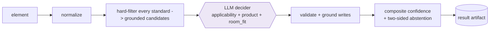
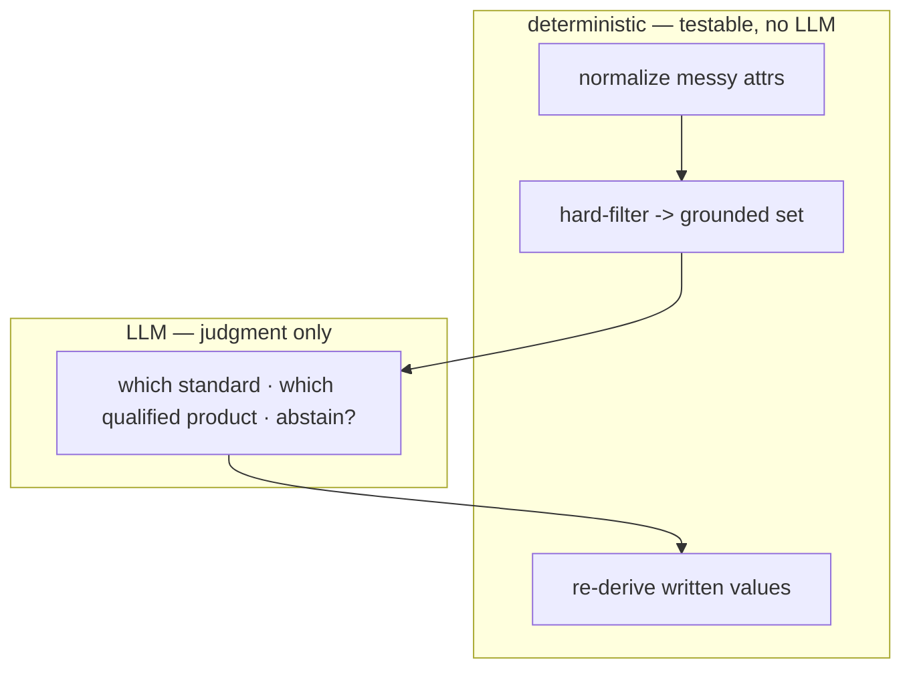
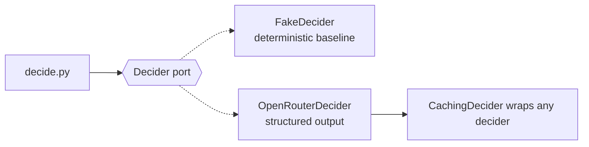

# Architecture

> An agent that inherits a firm's material **standards** into a Revit model. The hard part
> isn't string matching — it's **judgment**: which standard applies to an element, which
> approved product actually satisfies it, and when to **abstain** rather than guess. This
> document is the design reference; the build narrative and production plan are in
> [`SOLUTION.md`](../SOLUTION.md).

---

## 1. Scope

All three catalog categories and all four firm standards:

- *Acoustic ceilings in open-plan offices* — `min_nrc ≥ 0.80`, `fire = Class A`.
- *Ceilings in high-humidity rooms* — `humidity_resistance`, `fire = Class A`.
- *Exterior rainscreen cladding* — `nfpa_285`.
- *Resilient flooring in corridors* — `min_wear_mil ≥ 20`, `slip ≥ DCOF 0.42`.

Each category contributes only two things: its **messy-attribute normalizers** and its
**hard filter**. The rest of the pipeline — applicability, grounding, the decider, confidence,
abstention, the artifact — is category-agnostic and shared. A standard whose requirements
carry a key with no implemented filter is treated as unenforceable and its elements are
skipped honestly rather than mapped on a partial filter (`qualify.is_enforceable`).

**Category narrows scope; applicability is judged.** The single hardcoded signal is the
Revit-category → firm-category bridge (`firm.map_category`). It narrows the decider's search to
**same-category** standards: a ceiling is judged only against ceiling standards and their ceiling
products — never against the whole catalog across every category — which keeps the prompt from
carrying every material there is and is what makes the pass fast. An element whose category maps
to nothing the library covers (a door, a window, furniture, an interior partition) has no
same-category standard, so it **abstains** before any decider call. This decides *scope*, not
*choice*: within the in-scope standards, the decider still judges — from each standard's own
`intent` / `context` / `tags`, read straight from the firm library, with no keyword lists for
rooms — whether one governs the element (its exterior context and room) or whether **none
applies**. Which *product* and which *standard* fit an element live in the data, not in the code.

---

## 2. The core idea

The LLM is treated as an **unreliable component engineered around**, not an oracle. Every
number and every written value is produced by deterministic code; the model is used only for
the judgment that is genuinely linguistic — reading which standard applies (element category,
exterior context, **room semantics**) and the firm's **lessons-learned prose** — and it is
fenced in on both ends.



- **Code decides everything measurable:** parsing messy attributes, which products pass the
  hard requirements, and the exact values written to Revit.
- **The LLM decides only the soft judgment:** which standard applies to the element (or that
  none does), how well its room/context fits (`room_fit`), and which *already-qualified*
  product best honors the lessons-learned — or whether to abstain.
- **The seam between them is the honesty guarantee** (§4).

---

## 3. Pipeline (per element)

| Step | Module | LLM? | What it does |
|---|---|---|---|
| Normalize | `normalize.py` | no | messy attributes → typed canonical values, with provenance |
| Qualify | `qualify.py` | no | hard-filter every enforceable standard → the grounded candidate sets (the gate) |
| Decide | `decider/` | **yes** | judge which standard applies (category + exterior + room), pick a grounded product and `room_fit`, or abstain |
| Validate & ground | `decide.py` | no | reject ungrounded picks; re-derive written values from the catalog |
| Score | `confidence.py` | no | composite confidence, band → write / review / abstain |
| Emit | `artifact.py` | no | per-element decision, why, confidence, writes / abstention |

**Already-specified short-circuit.** Before the decider runs, a type already named after a
catalog product (e.g. `Acme - Northwind Quietude 300` → `cl-1004`) is treated as an explicit
human choice: the engine **confirms and stamps that product** instead of re-deciding it to a
different approved tile — and flags it for review if it no longer meets an applicable standard.

---

## 4. Grounding — the honest boundary

The invariant, enforced by tests: **no decision references a product outside the catalog,
and every written value is re-derived from the normalized product — never from the model's
text.**

- **Normalization** is where "keep it honest" starts. The catalog is deliberately messy —
  NRC appears as `.90`, `0.80 (NRC)`, `0.8`; fire rating in six forms (`Class A / Class 1`,
  `A`, `Class A (0-25)`…); humidity in seven. The LLM never parses these; total, unit-tested
  parsers do, encoding domain equivalence (ASTM E84 **Class A ≡ Class 1 ≡ Class I**). Over
  the real catalog, >95% of ceiling NRC and fire values parse.
- **The hard filter is the gate.** Given a standard's hard requirements, code computes the
  set of products that provably satisfy them. The decider is shown *only* this set (capped —
  see §6), so it cannot invent a product or pick a disqualified one.
- **Written values are re-derived.** After the decider picks a `product_id`, the parameters
  written (the four `Acelab_*` shared params + the built-in `Fire Rating`) come from the
  normalized catalog product. Specs with no Revit built-in (NRC, DCOF, NFPA 285, …) are
  documented, not written. The model's free text is used only
  for the human-readable rationale.



---

## 5. Confidence & abstention

The model's self-reported confidence is **one input, not the answer** — LLMs are poorly
calibrated. `confidence.py` combines it with other signals:

```
score = 0.40·room_fit + 0.25·approved + 0.35·llm_confidence      (×0.6 if a lesson is violated)
band  = write (≥0.75) · review (≥0.55) · abstain (<0.55)
```

`room_fit` is the decider's own categorical judgment (`match` / `weak` / `none`) of how well
the element's room or exterior context fits the chosen standard — **not** a keyword match;
nothing about room types is encoded in code, so an `Admin` office or a `Toilet` is understood
as it reads, not looked up in a list. `approved` and the lesson penalty are the structural
signals the model can't move. Every component is reported in the artifact, so a reviewer sees
*why* the confidence is what it is. **Abstention is two-sided:** the model may abstain, and code may *override to abstain*
even when the model was confident — an ungrounded product, an unknown standard, or a
below-threshold score all collapse to an honest abstention. (These overrides are unit-tested;
the sample ceilings all sit in unambiguous rooms, so natural abstention is exercised by
guardrail tests with synthetic inputs.)

Calibration is not fit statistically here (~20 elements); the thresholds are structural
proxies. Production calibration is discussed in [`SOLUTION.md`](../SOLUTION.md).

---

## 6. The decider seam

The engine assembles a grounded `DecisionContext` and hands it to a `Decider` (a `Protocol`).
Swapping the model or provider is a one-file change.



- **`OpenRouterDecider`** — OpenAI-compatible; strict `json_schema` structured output;
  `temperature=0`. System prompt states the rules: a standard only governs the kind of element
  it describes (match category first, respect exterior context), choose only from the provided
  candidates, judge `room_fit` yourself, prefer approved products, use `lessons_learned` to
  break ties and to *reject* a qualifying product the firm warns against, and abstain when no
  standard applies or the context is too ambiguous.
- **`FakeDecider`** — a deterministic baseline that reads each standard's **own** library
  vocabulary (`intent` / `context` / `tags`) to judge applicability and room fit, then takes
  the first approved qualified product. No keyword lists live in it. Not the product's
  intelligence; it lets the whole pipeline and the Revit adapter be built and tested with no
  LLM, no key, no spend — and it is honestly weaker than the LLM on synonyms (a `Toilet` reads
  as `weak` to it but `match` to the model).
- **`CachingDecider`** — wraps any decider. Two wins: identical elements share one decision
  key (the eight Open Office ceilings cost **one** call, and identical situations get
  identical decisions), and the cache persists to disk for **record/replay** in tests.
- **Context is capped.** A hard filter can leave 150+ products qualifying; the decider is
  shown the firm's approved products + a few alternatives, keeping prompts small and the
  decision focused.

---

## 7. Result artifact (the contract)

Emitted on every run — the audit document *and* the instruction the C# add-in executes.
Per element: `action` (map / abstain / skip), `matched_standard`, `chosen_product`,
`how` (how the standard was matched) and `why` (the decider's rationale), `confidence`
(score + band + components), `honors_lessons` / `violates_lessons`, and
for a mapping a `revit_write` block (`target_level: type`, parameters). Skips and abstentions
carry a `note`. Produce one by running the engine (see [`README.md`](../README.md)); the exact
schema is the `RunResult` model in `engine/src/acelab_mapping/models.py`, and
`artifacts/mapping-result.json` is a real example.

By default a mapped decision carries **only its best pick** — the `chosen_product` and its
`revit_write` — matching the lean shape of the sample artifact. Ranked `alternatives` are an
**opt-in** payload (`--alternatives`, engine `with_alternatives`) for the propose-select UI:
the **top 3** are scored (best-first) and the rest of the qualifying products follow unscored, so a
human can override to any grounded material. `alternatives[0]`
*is* `chosen_product`; each option is independently applicable — its own composite `confidence` and
re-derived `revit_write` — so the adapter writes whichever the user selects without re-deciding.

---

## 8. Revit adapter (thin, C#)

The engine owns 100% of the decisions; the add-in owns 100% of the Revit I/O and re-decides
nothing. It collects **ceilings, walls and floors** into the engine's snapshot shape (deriving
each ceiling/floor room spatially, since layered elements have no room property, and each wall's
exterior flag). A **human-in-the-loop review UI** (modeless WPF) streams the engine's ranked
suggestions per element; the architect picks a product — the top-3 recommendation pre-selected,
with any qualifying material available to override — and only on *Apply* does the add-in, in one
Transaction, bind the `Acelab_*` shared parameters (**type**-level), write the product parameters,
and **always duplicate the type** per product, reassigning only the selected instances so a shared
type (e.g. `600 x 600mm Grid` across an office and a wet room) never leaks the change to elements
the user did not pick.

The add-in lives in a **separate repo**: <https://github.com/arantesf/acelab-revit-challenge>.

---

## 9. Testing & model choice

- **104 tests, no network.** Normalization for all three categories against the real catalog
  (NRC, fire class, humidity, NFPA 285, wear layer in mixed units, DCOF), the hard-filter
  gate per category, confidence bands, the two-sided guardrails (replaying via the cache),
  and a **golden** expectation pinning the action of all 38 sample elements.
- **Model choice.** On the sample model's clean room names (`Open Office`, `Restroom`,
  `Pool Deck`, `Corridor`) every candidate model scores 100% — grounding makes the *product*
  choice a near-commodity. The **room/applicability judgment is not** a commodity, though:
  on messy real-world names (`Men` / `Women` as restrooms, `Conference` / `Admin` as
  office-adjacent-but-not-open-plan) `gpt-4o-mini` mis-routes and over-scores, while
  `gpt-4.1-mini` routes correctly and calibrates `room_fit` (a conference reads as *weak*, a
  men's room as a restroom → high-humidity). So `gpt-4.1-mini` is the default; the port keeps
  it a one-line config value (`ACELAB_MODEL`).

---

## 10. Layout

```
engine/src/acelab_mapping/
  models.py       typed inputs, canonical product, decision + artifact models
  normalize.py    messy → canonical parsers (total, unit-tested)
  catalog.py      load + index the catalog
  firm.py         firm-library loader (applicability is judged by the decider, not tabled here)
  qualify.py      hard-filter (the grounded gate) + enforceability check
  confidence.py   composite confidence + bands
  decide.py       per-element orchestration: context → decide → validate → ground → score
  decider/        base (port) · fake · openrouter · caching
  artifact.py     assemble the result artifact
  cli.py          `python -m acelab_mapping map …`
```
